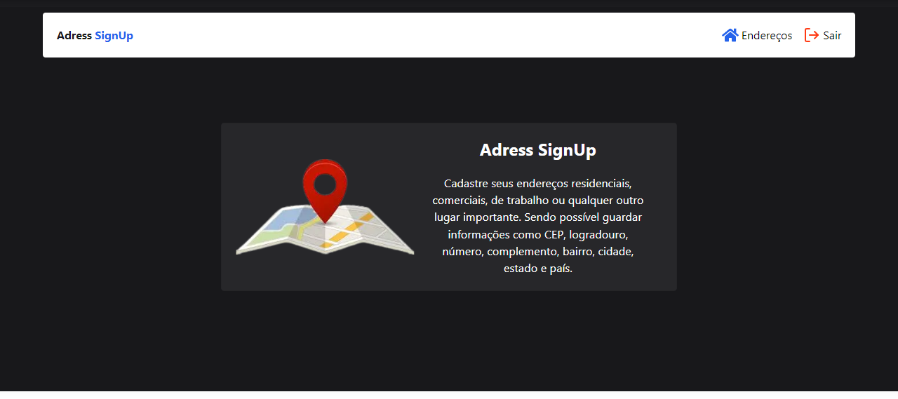
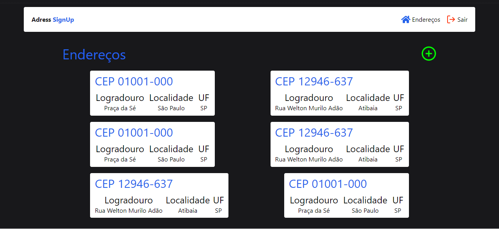
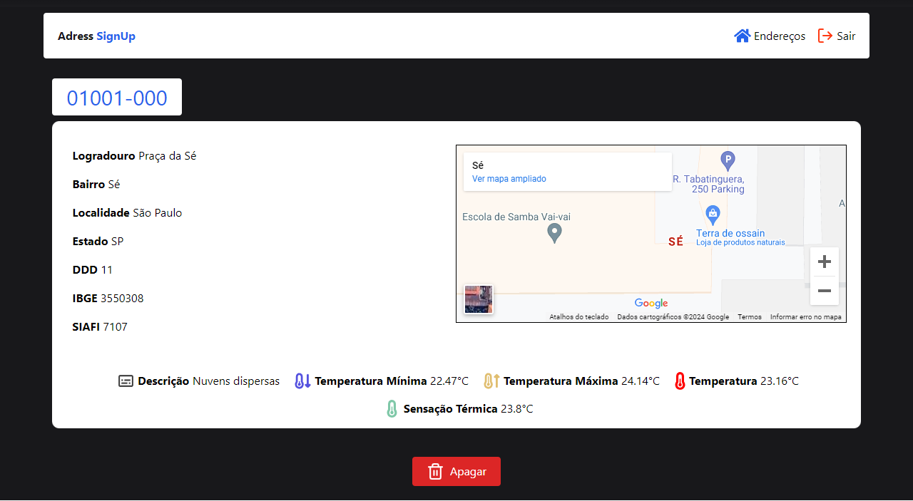

# Adress-SignUp
Esse projeto foi desenvolvido a partir de uma proposta simples do meu professor da máteria de PW, que seria uma explicação simples de como fazer requisições HTTP usando JS, a API de exemplo seria a do ViaCep, porém eu já havia desenvolvido um projeto nesses moldes lá em 2022, em um projeto que que vim a postar ano passado chamado ["Via-Cep"](https://github.com/Victor-Lis/ViaCep).

Então decidi adicionar algumas complexidades a mais, como um sistema de cadastro de endereços a partir do CEP e dados recebidos a partir da API, exibir um mapa para cada endereço respectivo, google-auth entre outros...

Nas versões posteriores, v1.47+ também são exibidas algumas informações climáticas do endereço salvo, como temperatura mínima e máxima, temperatura real e sensação térmica.

## Screenshots

## Versões 

### v1 <=
Projeto base, sistema de auth usando google, cadastro de endereços, pegando dados via CEP ou até passando o endereço

### v1.37 <=
Adicionando feature de mapa nos endereços

### v1.41 <=
Adicionado feature de clima, agora ao visualizar endereço é possível ver o clima dele

## Autores
- [@Victor-Lis]("https://github.com/Victor-Lis")
